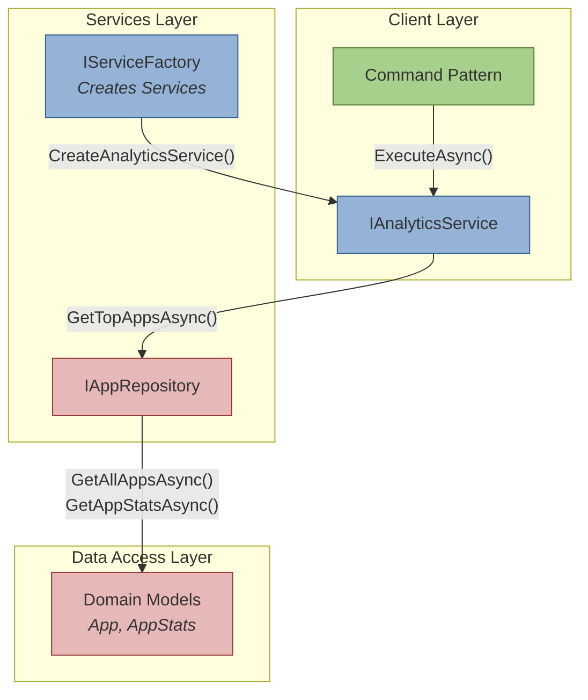

# AppFigures Analytics Application Documentation

This document provides comprehensive technical documentation for the AppFigures Analytics Application, a demonstration platform showcasing modern C# design patterns and architectural principles.

## Overview

The AppFigures Analytics Application is a console-based demonstration tool that implements a simplified app store analytics system. Built using .NET 8, it serves as a teaching resource for software architecture and design patterns while providing practical functionality for analyzing app metrics.

## Architectural Overview

The application employs a layered architecture pattern with clear separation of concerns, implementing multiple design patterns and principles. The following diagram illustrates the system's architecture and component relationships:



The architecture diagram above illustrates the three main layers of the application:

- Green Client Layer: Contains the Command Pattern implementation that initiates operations
- Blue Services Layer: Houses the business logic and factory pattern for service creation
- Red Data Access Layer: Manages domain models and repository interactions

Arrows indicate method calls and dependencies between components, showing how requests flow from the command layer down through services to data access.

## Domain Models

The application implements two primary domain models that represent core business entities:

```csharp
public record App(string Id, string Name, string Developer);
public record AppStats(int Downloads, decimal Revenue);
```

These immutable records represent:

- `App`: Basic application metadata
- `AppStats`: Application performance metrics

## Repository Pattern Implementation

The repository pattern provides data access abstraction through the `IAppRepository` interface:

```csharp
public interface IAppRepository
{
    Task<IEnumerable<App>> GetAllAppsAsync();
    Task<AppStats> GetAppStatsAsync(string appId);
}
```

Key features:

- Asynchronous operations for efficient I/O
- Interface segregation principle compliance
- Clear separation of data access concerns

## Service Layer

The `AnalyticsService` implements business logic for retrieving top-performing apps:

```csharp
public class AnalyticsService : IAnalyticsService
{
    private readonly IAppRepository _repository;

    public AnalyticsService(IAppRepository repository)
    {
        _repository = repository;
    }

    public async Task<IEnumerable<(App App, AppStats Stats)>> GetTopAppsAsync(int count)
    {
        var apps = await _repository.GetAllAppsAsync();
        var results = new List<(App, AppStats)>();

        foreach (var app in apps)
        {
            var stats = await _repository.GetAppStatsAsync(app.Id);
            results.Add((app, stats));
        }

        return results.OrderByDescending(r => r.Stats.Revenue).Take(count);
    }
}
```

Implementation highlights:

- Dependency injection through constructor
- Async/await pattern for efficient operation
- LINQ usage for data transformation
- Value tuple return type for clean data structure

## Design Patterns Implementation

### Abstract Factory Pattern

```csharp
public interface IServiceFactory
{
    IAnalyticsService CreateAnalyticsService();
}

public class ServiceFactory : IServiceFactory
{
    public IAnalyticsService CreateAnalyticsService()
    {
        return new AnalyticsService(new AppRepository());
    }
}
```

Provides service instantiation abstraction while maintaining dependency injection principles.

### Command Pattern

```csharp
public interface ICommand
{
    Task ExecuteAsync();
}

public class GetTopAppsCommand : ICommand
{
    private readonly IAnalyticsService _analyticsService;
    private readonly int _count;

    public GetTopAppsCommand(IAnalyticsService analyticsService, int count)
    {
        _analyticsService = analyticsService;
        _count = count;
    }

    public async Task ExecuteAsync()
    {
        var topApps = await _analyticsService.GetTopAppsAsync(_count);
        Console.WriteLine($"Top {_count} Apps by Revenue:");
        foreach (var (app, stats) in topApps)
        {
            Console.WriteLine($"{app.Name} by {app.Developer}: ${stats.Revenue:N2}");
        }
    }
}
```

Encapsulates operations as objects, enabling flexible command execution and extension.

## Technical Features

### Modern C# Features

- Records for immutable domain models
- Nullable reference types for null safety
- Pattern matching with tuples
- Async/await for asynchronous programming
- LINQ for data transformations

### Principles Implementation

1. DRY Principle
  - Single responsibility per component
  - Shared interfaces for common operations
  - Consistent naming conventions


2. SOLID Principles
  - Single Responsibility: Each class handles one concern
  - Open/Closed: Extension through interfaces
  - Liskov Substitution: Interface-based design
  - Interface Segregation: Focused interfaces
  - Dependency Inversion: Abstraction over concretions


## Getting Started

Clone the repository containing the source codeEnsure .NET 8 SDK is installedRestore NuGet packagesRun the application using `dotnet run`## Extending the Application

The architecture supports easy extension through:

- Adding new commands implementing `ICommand`
- Creating new services through the factory pattern
- Implementing additional repository interfaces
- Adding new domain models as needed

## Version Control Guidelines

Create a new repository on GitHub/GitLabClone the repository locallyCreate feature branches for modificationsSubmit pull requests for reviewMaintain detailed commit messagesThis documentation covers the technical implementation details while maintaining clarity and professionalism. The application serves as a reference implementation for modern C# development practices and architectural patterns.
