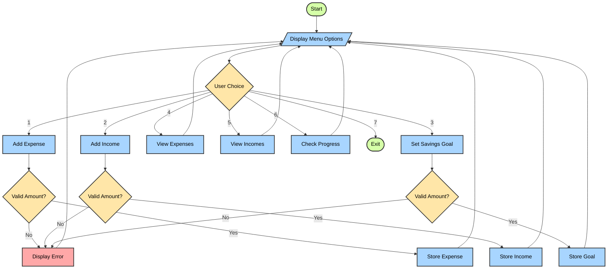
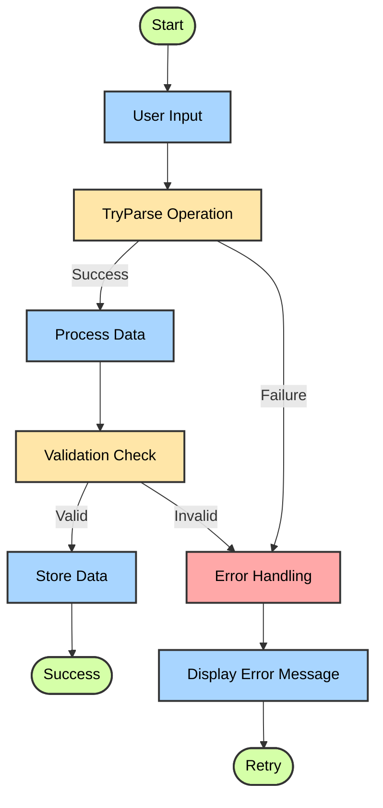

Personal Finance Tracker (PFT) Technical Documentation

By Leeroy D'Souza

March 26, 2025

|  | Introduction |
| --- | --- |
|  | Features Overview |
|  | Code Structure |
|  | Usage Instructions |
|  | Running Demos |
|  | Design Choices |
|  | Best Practices |
|  | Next Steps |
|  | Glossary |

## Introduction

This technical documentation covers the Personal Finance Tracker (PFT) application, a console-based financial management tool written in C#. The application enables users to track expenses, incomes, and savings goals while providing comprehensive reporting functionality.

## Features Overview

The application offers the following core functionalities:

- Expense tracking with categories and amounts
- Income recording
- Savings goal setting
- Financial progress monitoring
- Comprehensive error handling

## Code Structure

### Class Design

```csharp
class Expense
{
    public string Category { get; set; }
    public decimal Amount { get; set; }
    public DateTime Date { get; set; }

    public Expense(string category, decimal amount, DateTime date)
    {
        Category = category;
        Amount = amount;
        Date = date;
    }
}
```

The `Expense` class demonstrates proper encapsulation with properties and a constructor. This design choice provides clean data management while maintaining flexibility for future enhancements.

### Main Program Structure

The application uses a menu-driven interface with static methods organized by functionality:

- Data Management Methods (AddExpense, AddIncome)
- View Methods (ViewExpenses, ViewIncomes)
- Analysis Methods (CheckSavingsProgress)
- Configuration Methods (SetSavingsGoal)

## Usage Instructions

Launch the applicationChoose from the menu options (1-7)Follow the prompts for each operationReview your data using the view optionsExit when finished## Running Demos

### Basic Operations Demo

1. Run the application
2. Add an expense:
```
Option 1 > Category: Groceries > Amount: 50.00
```


3. Add an income:
```
Option 2 > Amount: 1000.00
```


4. Set a savings goal:
```
Option 3 > Amount: 500.00
```


5. View progress:
```
Option 6
```


### Error Handling Demo

1. Invalid amount entry:
```
Option 1 > Category: Food > Amount: abc
```


2. Empty lists handling:
```
Option 4 (when no expenses exist)
```


3. Division by zero prevention:
```
Option 6 (with zero savings goal)
```


## Design Choices

1. **Type Safety**  - Used `decimal` for financial calculations to avoid floating-point precision issues
  - Implemented proper type conversion with TryParse


2. **Error Handling**  - Comprehensive exception catching in all operations
  - Clear error messages for user feedback
  - Graceful recovery from invalid inputs


3. **Code Organization**  - Separated concerns into distinct methods
  - Consistent naming conventions
  - Clear separation of UI logic and business logic


## Best Practices

1. **Input Validation**  - Validates all numeric inputs
  - Checks for empty collections
  - Prevents null references


2. **Code Readability**  - Clear method naming
  - Consistent formatting
  - Descriptive variable names


3. **User Experience**  - Intuitive menu system
  - Informative feedback messages
  - Easy navigation


## Next Steps

1. Enhancement Possibilities:
  - Add persistent storage
  - Implement data visualization
  - Add budget categories
  - Include reporting features


2. Maintenance Recommendations:
  - Regular code reviews
  - Performance monitoring
  - Security audits


## Glossary

- **Encapsulation**: Bundling data and methods that operate on that data within a single unit
- **Type Safety**: Ensuring operations are performed on appropriate data types
- **Exception Handling**: Managing runtime errors gracefully
- **Separation of Concerns**: Organizing code into distinct sections based on functionality
- **TryParse**: Safe conversion of strings to numeric types

## Application Flow Diagram



The flow diagram above illustrates the application's core functionality and error handling mechanisms. The color coding represents different types of operations:

- Green terminals (Start/Exit) show the application boundaries
- Blue processes show main operations
- Yellow diamonds indicate decision points
- Red boxes highlight error handling

Each path through the diagram represents a possible user interaction, with all operations returning to the main menu after completion or error handling.

## Error Handling Flow Diagram



The error handling diagram above shows the application's robust error handling mechanism:

- All user inputs go through a TryParse operation to ensure valid numeric data
- Successful parsing leads to data validation before storage
- Invalid inputs or failed validation trigger the error handling system
- Users can retry operations after receiving clear error messages

This comprehensive error handling ensures data integrity and provides a smooth user experience even when invalid inputs are provided.
